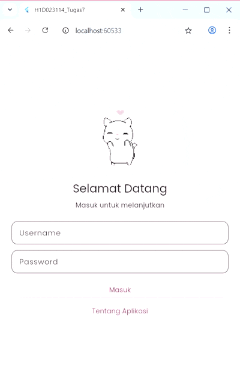

# H1D023114_Tugas7 – Pemrograman Mobile

---

## **Identitas**

Nama  : Essay Bina Mukti
NIM   : H1D023114
Shift : Shift F

---

## **Deskripsi Proyek**

Aplikasi Flutter ini dibuat untuk memenuhi **Tugas 7 Pemrograman Mobile** dan berfokus pada implementasi:

* **Login System** dengan validasi sederhana
* **Local Storage** menggunakan SharedPreferences
* **Named Routes** sebagai navigasi utama
* **Side Menu (Drawer)** untuk navigasi cepat antar halaman
* Halaman **Home**, **Profil**, dan **Tentang Aplikasi**
* Desain bertema **soft pink**, modern, dan konsisten

---

## **Penjelasan Struktur Kode**

Berikut penjelasan setiap file penting di dalam folder `lib/`.

### **main.dart**

* Menjadi entry point aplikasi.
* Mengecek apakah sudah ada username tersimpan di SharedPreferences.
* Menentukan halaman awal: **Login** atau **Home**.
* Menerapkan tema global dari `theme.dart`.
* Menghubungkan semua halaman melalui routes dari `routes.dart`.

### **theme.dart**

Mengatur tampilan global aplikasi:

* Warna utama menggunakan palet **soft pink pastel**.
* Menggunakan Google Fonts untuk tipografi.
* Mengatur style input form agar konsisten.

### **routes.dart**

Menampung semua **Named Routes**:

```dart
final Map<String, WidgetBuilder> appRoutes = {
  '/': (context) => LoginPage(),
  '/home': (context) => HomePage(),
  '/about': (context) => AboutPage(),
  '/profile': (context) => ProfilePage(),
};
```

Mempermudah pengelolaan navigasi antar halaman.

---

### **pages/login_page.dart**

Halaman pertama aplikasi yang berfungsi untuk autentikasi.
Berisi:

* Form input username & password
* Validasi sederhana
* Loading indicator saat proses login
* Snackbar untuk pesan error
* Penyimpanan username ke SharedPreferences
* Navigasi ke **HomePage** setelah login berhasil

*Credential login default:*

* Username: **admin**
* Password: **password**

---

### **pages/home_page.dart**

Halaman utama setelah login. Menampilkan:

* Sapaan berdasarkan username yang tersimpan
* Beberapa **feature cards** berisi ringkasan fitur aplikasi
* Informasi tambahan melalui **info box**
* Tampilan bersih, rapi, dan informatif tanpa elemen berlebihan

Halaman ini berfungsi sebagai ringkasan dari seluruh fitur aplikasi.

---

### **widgets/side_menu.dart**

Drawer (side menu) yang berisi:

* Avatar berdasarkan huruf pertama username
* Menu navigasi: **Beranda**, **Profil**, **Tentang**
* Tombol logout untuk menghapus username & kembali ke login

Side menu ini memudahkan navigasi antar halaman dalam aplikasi.

---

### **pages/profile_page.dart**

Halaman profil berisi:

* Avatar huruf depan username
* Informasi username
* Kartu informasi profil
* Tombol kembali ke halaman sebelumnya

Halaman ini hanya tampilan informasi, **tanpa fitur edit profil**.

---

### **pages/about_page.dart**

Halaman yang menjelaskan:

* Informasi aplikasi secara umum
* Fitur yang tersedia
* Tujuan pembuatan aplikasi
* Teknologi yang digunakan
* Identitas pembuat

---

### **Demo Aplikasi**



---

## **Konfigurasi Dependencies**

```yaml
dependencies:
  flutter:
    sdk: flutter
  cupertino_icons: ^1.0.8
  shared_preferences: ^2.0.17
  google_fonts: ^4.0.3
  flutter_svg: ^2.0.7
```

---

## **Kesimpulan**

Aplikasi ini berhasil mengimplementasikan:

* **Login & Session Handling** menggunakan SharedPreferences
* **Navigasi** menggunakan Named Routes
* **Side Menu** sebagai navigasi utama
* **Tema custom soft pink**
* Tampilan halaman Home, Profil, dan Tentang yang rapi & informatif


---
